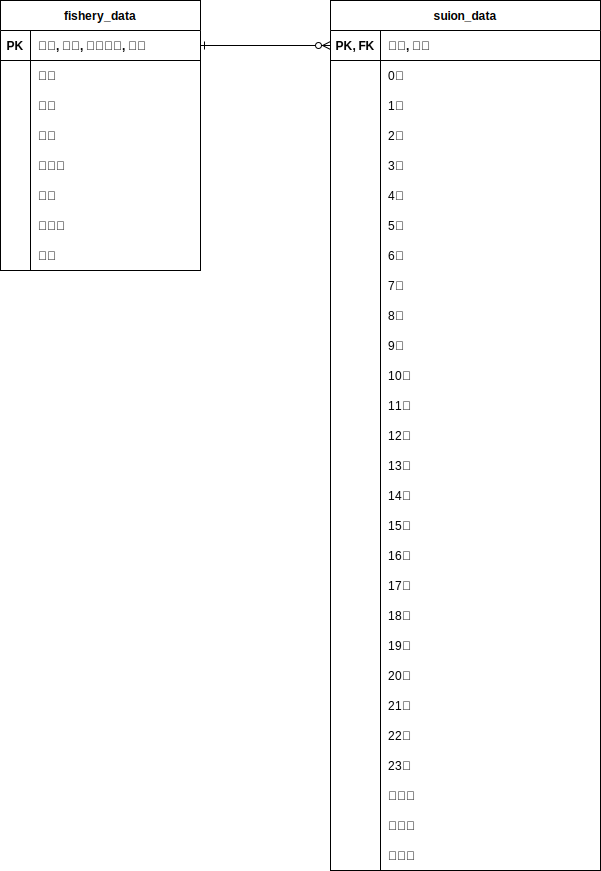

# About dataset
This dataset distributed by [いわて大漁ナビ 岩手県水産情報配信システム](https://www.suigi.pref.iwate.jp)  

NOTE: If you want to use this datasets, you should be write 「岩手県水産技術センター水産情報配信システム調べ」  
We make no guarantees about what will result from the use of this datasets.  
You should be contact [いわて大漁ナビ 岩手県水産情報配信システム](https://www.suigi.pref.iwate.jp/) by yourself.

## About Images
- IMG_CLASS
    - 7Dc: NOAA/AVHRR 1日合成最新画像
    - 7Wc: NOAA/AVHRR 1週間合成最新画像
    - 7Ad: 自前で生成した、7Dc(1日合成最新画像)を当日から7日後までの画像を合成したもの

## About DB
This database used SQLite3 and .csv files are output of db.

### ER図

### Description
- fishery_data
PK: 場所, 日付, 漁業種類, 魚種

| カラム名    | 説明        | 型   | 例 |
|---------|-------------|------|----|
| 場所     | 船の所属湾   | text |    |
| 日付     | 漁の日付     | text |    |
| 漁業種類 | 漁業手法    | text |    |
| 隻数     | 漁に行った隻数 | text |    |
| 魚種     | 魚種        | text |    |
| 規格     |             | text |    |
| 本数     |             | text |    |
| 水揚量   |             | text |    |
| 高値     |             | text |    |
| 平均値   |             | text |    |
| 安値     |             | text |    |

- suion_data
PK: 場所, 日付

| カラム名  | 説明        | 型   | 例 |
|-------|-----------|------|----|
| 場所   | 船の所属湾   | text |    |
| 日付   | 漁の日付     | text |    |
| 0時    | 0時の水温    | text |    |
| 1時    | 1時の水温    | text |    |
| 2時    | 2時の水温    | text |    |
| 3時    | 3時の水温    | text |    |
| 4時    | 4時の水温    | text |    |
| 5時    | 5時の水温    | text |    |
| 6時    | 6時の水温    | text |    |
| 7時    | 7時の水温    | text |    |
| 8時    | 8時の水温    | text |    |
| 9時    | 9時の水温    | text |    |
| 10時   | 10時の水温   | text |    |
| 11時   | 11時の水温   | text |    |
| 12時   | 12時の水温   | text |    |
| 13時   | 13時の水温   | text |    |
| 14時   | 14時の水温   | text |    |
| 15時   | 15時の水温   | text |    |
| 16時   | 16時の水温   | text |    |
| 17時   | 17時の水温   | text |    |
| 18時   | 18時の水温   | text |    |
| 19時   | 19時の水温   | text |    |
| 20時   | 20時の水温   | text |    |
| 21時   | 21時の水温   | text |    |
| 22時   | 22時の水温   | text |    |
| 23時   | 23時の水温   | text |    |
| 日平均 | 日平均の水温 | text |    |
| 日最大 | 日最大の水温 | text |    |
| 日最小 | 日最小の水温 | text |    |